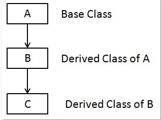

### Multi Lavel Inheritance

<div align="center">

</div>

****
```python
class base:
	// Members and Functions
	Pass
class derived1(base):
	// Members and functions of both base and derived1 classes
	pass
class derived2(derived1):
	// Members and functions of base class, derived1 class, and derived2 class.
	Pass
```
****
### How Multilevel Inheritance Works in Python?
****
Multilevel inheritance in Python allows a class to inherit properties and methods from a class that is already inherited from another class. This means that a subclass can be derived from a parent class, and that subclass can be used as a parent class for another subclass. The subclasses inherit all the attributes and methods of their parent classes, allowing them to reuse and extend functionality. In Python, we can create a chain of inheritance by creating subclasses that inherit from other subclasses, resulting in a multilevel inheritance hierarchy. This allows us to create complex class structures that are easy to understand and maintain.

****
### Example 1:

```python
class Person:
    def __init__(self):
        print('Person - Hii')

    def age(self, a):
        print('Printing the age: ', a)
```

****
- This defines a class named `Person`.
- It has an `__init__` method which prints "Person - Hii" when an instance of the class is created.
- It also has a method named `age` which takes a parameter `a` and prints "Printing the age: " followed by the value of `a`
****
```python
class Father(Person):
    def __init__(self):
        print('Father - Hii')
        super().__init__()

    def age(self, a):
        print('Printing the age(Father): ', a)
        super().age(a - 1)
```
****
- This defines a class named `Father` which inherits from the `Person` class.
- It overrides the `__init__` method to print "Father - Hii" before calling the `__init__` method of the superclass using `super()`.
- It also overrides the age method to print "Printing the age(Father): " followed by the value of a and then calls the age method of the superclass with a - 1.
****
```python
class Mother(Father):
    def __init__(self):
        print('Mother - Hii')
        super().__init__()

    def age(self, a):
        print('Printing the age(Mother): ', a)
        super().age(a + 5)
```
****
- This redefines the class `Mother` which now inherits from the `Father` class.
- It overrides the `__init__` method to print "Mother - Hii" before calling the `__init__` method of the superclass using `super()`.
- It also overrides the age method to print "Printing the age(Mother): " followed by the value of a and then calls the age method of the superclass with `a + 5`.
****
```python
o = Mother()
o.age(30)
```
****
- This creates an instance `o` of the `Mother` class.
- Then it calls the `age` method of the instance `o` with the `value 30`

****
In summary, this code demonstrates multi-level inheritance where `Mother` inherits from `Father` which in turn inherits from `Person`, and method overriding is utilized to customize behavior at each level of inheritance. When an instance of `Mother` is created and its `age` method is called, it prints messages indicating which class's method is being executed and then invokes the method of the superclass with adjusted parameters.
